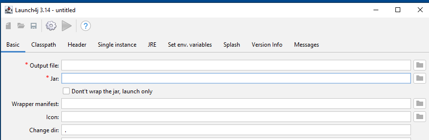
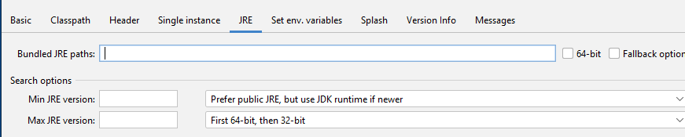
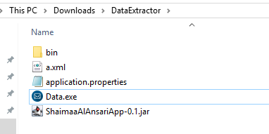
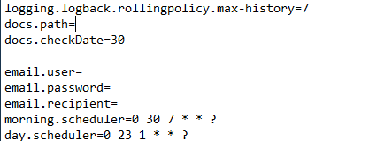

1. Install Java 17 and Launch4j.

2. Create jar file from project without "application.properties".

3. Create main folder, add jar and application.properties file inside this folder. 

4. Create "bin" folder inside main. Add inside bin "jre" folder with all files from Java 17 folder.

5. Start the Launch4j: put new exe in main folder in "Output file" field; 

put jar in "Jar" field; 

put bin folder in JRE -> "Bunded JRE paths" field; 

build wrapper; save script into main folder.

6. Inside application.properties file: in docs.path write path to folder with PDF files; in morning.scheduler and day.scheduler write a date to receive reports; in email.user / email.password / email.recipient write email and password of sender's account and email of recipient; save file. 

7. Start exe file. App starts to handling PDFs in scheduled dates.

8. Reports will be saved in main file. You can watch logs in file in log folder.