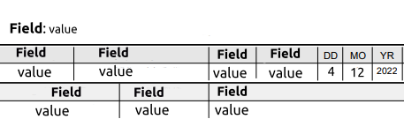
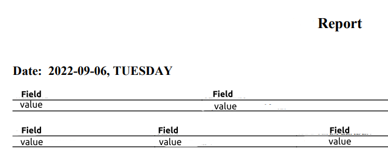

# Extracting data from a pdf report

## description
The client has a big amount of different reports daily. We developed an automatization tool that takes only necessary and not handled PDF reports from the folder twice a day, parses the data from reports, and formes new reports using only the data the client needs. All new reports save to the other folder so the client doesn’t need to waste too much time checking each report daily.

## examples
### input/output file

**input**

**output**